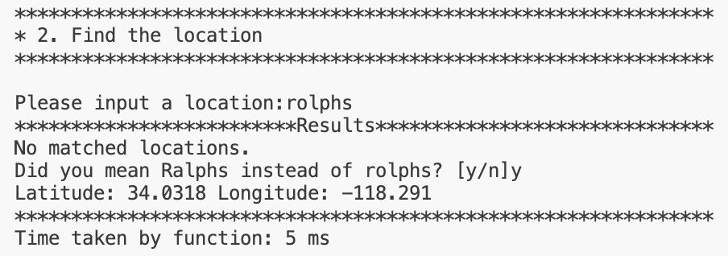
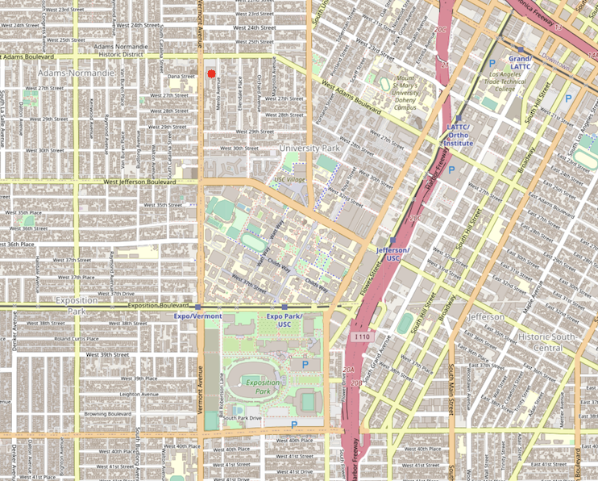

<center><h3>EE 538 - Computing Principles for Electrical Engineers</h3></center>

<center><h1>Trojan Map Report</h1></center>

<center><h3>Team Member: Yuhui Wu(USC ID:6466358591)  Junfei Huang(USC ID:5555112745)</h3></center>

### Member Functions & Variables
| Name                                             | Description                                                  |
| ------------------------------------------------ | ------------------------------------------------------------ |
| **Phase 1**                                      |                                                              |
| [.Autocomplete](#autocomplete)                   | Complete the location name given a half-word                 |
| [.GetLat](#getlat])                              | Return the latitude of a location                            |
| [.GetLon](#getlon])                              | Return the longtitude of a location                          |
| [.GetName](#getname)                             | Return the name of a location                                |
| [.GetID](#getid)                                 | Return the unique identification of a location               |
| [.GetNeighborIDs](#getneighborids)               | Return neighbors of a location                               |
| [.GetPosition](#getposition)                     | Return the coordinate of a location                          |
| [.CalculateEditDistance](#calculateeditdistance) | Calculate a the shortest edit distance of two strings        |
| [.FindClosestName](#findclosestname)             | Find out the cloest name matched with the given one          |
| **Phase 2**                                      |                                                              |
| [.GetAllCategories](#getallcategories)           | Return all available categories                              |
| [.GetAllLocationsFromCategory](#getalllocations) | Return all locations that match that category                |
| [.GetLocationRegex](#getlocationregax)           | Return all location ids that match the regular expression    |
| [.CalculateShortestPath_Bellman_Ford](#bellman)  | Given two location, return its shortest path using bellman algorithm |
| [.CalculateShortestPath_Dijkstra](#dijkstra)     | Given two location, return its shortest path using dijkstra  algorithm |
| [.CycleDetection](#cycledetection)               | Check  if there is a cycle path in the subgraph              |
| [.DeliveringTrojan](#topo)                       | Sort the nodes in the order of topological                   |
| **Phase 3**                                      |                                                              |
| [.TravellingTrojan_Brute_force](#bruteforce)     | Given a set of nodes, return the solution for TSP problems   |
| [.TravellingTrojan_Backtracking](#backtracking)  | Given a set of nodes, return the solution for TSP problems optimized by DP and BT |
| [.TravellingTrojan_2opt](#2opt)                  | Return a heuristic solution for TSP problems                 |
| [.FindNearby](#findnearby)                       | Given a radius and search the location nearby                |
| [.TrojanPath](#trojanpath)                       | Find the shortest path to visit all the locations            |
| [.Queries](#queries)                             | Check connectivity with gas tank constraints using Union-Find|

### Detailed Implimentation
## Phase 1
# 1. Autocomplete
```c++
std::vector<std::string> Autocomplete(std::string name);
```
Time complexity: O(m*n), where n is the number of nodes in the map and m is the average length of node names
**Steps:**
1. Iterate over data
2. Convert strings to lowercase
3. Substring comparison
**Result of the output**


# 2. Find the location
# 2-1. Get Position
```c++
std::pair<double, double> GetPosition(std::string name);
```
Time complexity : O(m*n), where n is the number of nodes in the map and m is the average length of node names
**Steps:**
1. Initialize the result
2. Iterate over the map
3. Compare the node name
- For each node, the name field of the current node (iter->second.name) is compared with the input string (name)
4. Return the results
# 2-2. Calculate Edit Distance
```c++
int CalculateEditDistance(std::string name1, std::string name2);
```
Time complexity: O(m*n) where n is the number of nodes in the map and m is the average length of node names
**Steps:**
1. Initialization
- Create a 2D matrix dp of size (m+1) * (n+1) to store the edit distance for each substring combination
2. Base Case Setup
- Fill the first row of the matrix: If i=0, the cost is j 
- Fill the first column of the matrix: If j=0, the cost is i
3. Recursive Case
- If a[i-1] == b[j-1], copy the value from dp[i-1][j-1] (no cost)
- Otherwise, calculate the minimum cost among:
    - Delete a character: dp[i-1][j] + 1
    - Insert a character: dp[i][j-1] + 1
    - Replace a character: dp[i-1][j-1] + 1
4. Return the result

**Example table for inputs "ralphs" and "rolphs"**
|      | Base Case  | r   | o   | l   | p   | h   | s   |
|:----:|:----------:|:---:|:---:|:---:|:---:|:---:|:---:|
|      | 0          | 1   | 2   | 3   | 4   | 5   | 6   |
|  r   | 1          | 0   | 1   | 2   | 3   | 4   | 5   |
|  a   | 2          | 1   | 1   | 2   | 3   | 4   | 5   |
|  l   | 3          | 2   | 2   | 1   | 2   | 3   | 4   |
|  p   | 4          | 3   | 3   | 2   | 1   | 2   | 3   |
|  h   | 5          | 4   | 4   | 3   | 2   | 1   | 2   |
|  s   | 6          | 5   | 5   | 4   | 3   | 2   | 1   |
**Result of the output**
| Output | Map |
| :---: | :---: |
|  | 

## Phase 2
# 3. Find all location categories
```c++
std::vector<std::string> GetAllCategories();
```
Time Complexity: O(N*M+K*logK), where N is the number of locations, M is the average number of categories per location and K is the total number of unique categories
**Steps:**
1. Input Dataset Traversal
2. Unique Categories Extraction
3. Conversion to Vector
4. Sorting
5. Return the Result
**Result of the output**


# 4. Get all Locations of a Category
